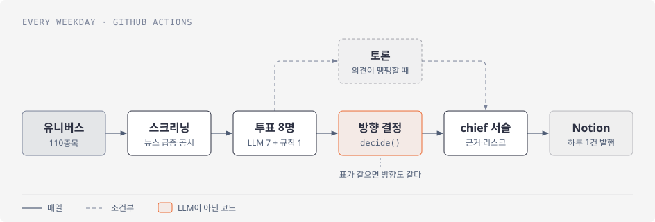
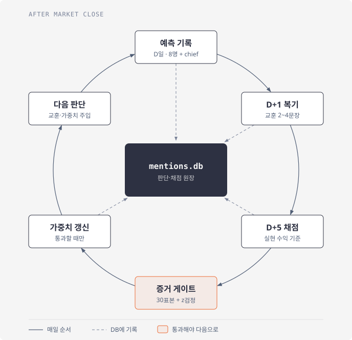
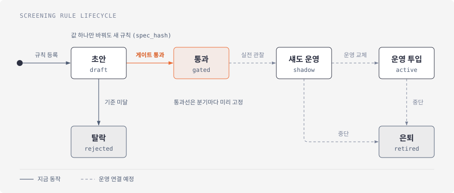

# 데일리 주식 리포트

평일 새벽마다 한국 주식 110종목을 훑어서 새 소식이 있는 종목만 고르고 AI 에이전트 8명이 각자 의견을 냅니다. 매수·매도 방향은 LLM이 아니라 코드로 된 규칙이 정합니다. 결과는 Notion에 리포트 한 장으로 올라갑니다.

> 포트폴리오용 공개본이라 프롬프트와 실제 매매 규칙 값은 가려 두었습니다.

## 하루 흐름



스크리닝은 가격 패턴 대신 뉴스가 갑자기 늘었거나 공시가 나온 종목을 봅니다. 10년 넘는 데이터로 돌려 보니 가격·거래량 신호는 무작위로 고른 것보다 나을 게 없었습니다.

투표자 중 한 명은 LLM을 쓰지 않는 규칙 에이전트입니다. LLM 7명이 규칙 하나보다 나은지 비교하려고 넣었습니다. 토론은 의견이 팽팽한 날에만 열리고 결론 문장에만 영향을 줍니다.

### 방향을 규칙에 맡긴 이유

처음에는 Claude(opus)가 프롬프트에 적힌 규칙대로 방향을 정하게 했습니다. 그런데 운영 기록 40건을 같은 규칙으로 다시 계산하니 BUY 15, SELL 20, HOLD 5가 나와야 했는데 모델은 BUY 3, SELL 0, HOLD 37을 냈습니다. 그 뒤로 방향은 `chief_python.decide()`가 정하고 모델은 근거와 리스크만 씁니다.

## 채점과 학습



예측은 5거래일 뒤 실제 수익률로 채점합니다. 원래는 다음 날 종가로 매겼는데, 1~4주 들고 가는 걸 전제로 하면서 하루 등락으로 점수를 주는 건 맞지 않았습니다.

에이전트 가중치는 표본이 30개 쌓이고 성적이 동전 던지기와 통계적으로 다를 때만 바뀝니다. 그 전까지는 8명 모두 같은 비중입니다. chief의 판단은 다음 날 결과를 보고 두세 문장짜리 교훈으로 남겨 두었다가, 이후 판단 때 다시 읽힙니다.

## 새 규칙은 검증부터



규칙 하나는 항목 7개짜리 JSON 파일입니다. 값을 하나만 바꿔도 다른 규칙으로 취급해서 결과를 본 뒤 숫자를 만져 통과시키는 걸 막았습니다. 게이트는 2016년 이후 데이터로 무작위 대조군과 비교하고 한 분기에 시험하는 가설 수만큼 통과선을 높입니다(Bonferroni). 공개본에는 형식을 보여 주는 예시 파일만 있습니다.

## 실패에 대한 대비

- 노드마다 제한 시간이 있습니다. 실패한 에이전트는 확신도 0으로 처리돼 투표에서 빠집니다.
- 에이전트가 전부 실패했는데 겉으로는 성공한 것처럼 보이는 날은 실행을 실패로 끝내고 GitHub Issue를 엽니다.
- 데이터가 부족하면 `data_sufficient=false`로 답하게 했습니다. 근거를 억지로 채우다 숫자를 지어내는 일을 막으려는 장치입니다.
- 한 번 실행할 때 쓸 수 있는 LLM 비용에 상한을 두었습니다. 9월 13일 실측은 4종목에 $0.28였고 그중 92%가 chief(opus) 몫이었습니다.

## 사용 기술

Python 3.11, LangGraph, LangChain, Anthropic·OpenAI SDK, FastMCP(직접 만든 서버 3개, 도구 32개), SQLite, ChromaDB + BM25, pykrx, yfinance, GitHub Actions

| 역할 | 모델 |
|---|---|
| 전문가 7명 | gpt-4o-mini |
| Bull/Bear 토론 | claude-sonnet-4-6 |
| 최종 서술 | claude-opus-4-6 |
| 뉴스 스크리닝 | claude-haiku-4-5 |

## 실행

```bash
pip install --no-deps -r requirements-freeze.txt   # langchain-core 1.3.3 고정 때문에 --no-deps
python -m src.daily_runner                         # 스크리닝 → 분석 → 발행
pytest tests/ -m "not costly" -q                   # 유료 API를 안 쓰는 테스트 904건
```

API 키 목록은 [CLAUDE.md](CLAUDE.md)에 있습니다. 프롬프트가 비어 있어서 돌아가긴 해도 분석 내용은 실제 시스템과 다릅니다.

## 아직 답하지 못한 것

돈을 버는 시스템인지는 아직 모릅니다. 측정 장치는 다 붙였지만 결론을 내려면 175거래일 정도의 표본이 더 필요합니다. 실제 주문은 넣지 않고 매매는 리포트를 읽은 사람이 합니다.

문의: xogur1578@gmail.com
